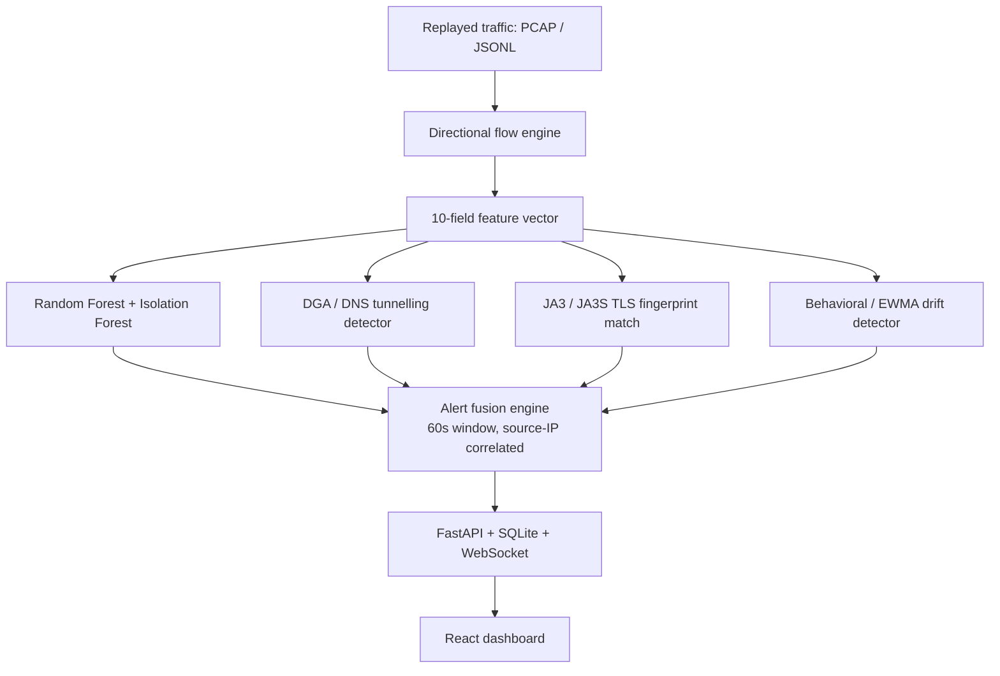

# Unidirectional Threat Detector

**AI-based cyber threat detection over one-way (data-diode) IP traffic — SIH 2026, PS 26145 (NTRO).**

---

## What this is

Some networks are watched through a **data diode** — a one-way mirror that copies traffic into a monitoring room with no way to talk back. That's great for security (nothing in the monitoring room can ever become a foothold into the real network), but it means any detection system has to work from *observation alone*: no probes, no completed handshakes it initiates, no commands sent back across the wire.

This project is that detection system. It watches a replayed stream of network traffic, extracts the same 10 statistical features a firewall analyst would look at, runs them through a trained ML pipeline, and raises **evidence-backed alerts** — severity, confidence, and a plain-language reason — on a live dashboard. Everything happens one flow at a time, in near real time, never in an end-of-day batch report.

---

## The threats it looks for

| # | Threat | How it's caught |
|---|---|---|
| 1 | Volumetric / protocol DDoS (SYN floods) | Flow-level SYN rate and packet-timing statistics |
| 2 | Botnet C2 beaconing | Regular, low-variance inter-arrival timing toward a small set of destinations |
| 3 | DGA domains / DNS tunnelling | Entropy + n-gram scoring on DNS query names, query-length anomalies |
| 4 | Malware in encrypted (TLS/QUIC) sessions | JA3/JA3S fingerprint blocklist matching — metadata only, payload is never touched |
| 5 | Reconnaissance / port scanning | Fan-out across destination ports/hosts from one source |
| 6 | Data exfiltration | Cross-branch correlation: 2+ of the above firing on the same source inside a rolling window escalates automatically |

Threats 1–5 are independent, always-on detection branches. Threat 6 isn't a separate model — it's what happens when the fusion engine sees several of the other five agree on the same source IP within 60 seconds. That correlation logic (and the behavioral/EWMA branch it also fuses) is implemented and validated in `scripts/`; wiring it into the live backend end-to-end is the next integration step (see [Status](#status--roadmap) below) — flagged here rather than glossed over, since a prototype should say plainly what's proven versus what's still being connected.

---

## Architecture



**Read-only by design, every hop of the way:** the flow engine only ever reads from the replay source, the ML branch never re-touches a completed handshake, and the JA3/TLS branch reads only the unencrypted parts of a TLS handshake — the payload is never decrypted, inspected, or even referenced.

### Why 10 features, not more

The feature set was pared down from an earlier 12-field draft after profiling the training data: two fields (`Fwd Packet Length Std`, `Flow IAT Max`) turned out to be near-duplicates of ones we kept, so they were cut rather than carried along for no benefit.

| Field | What it captures |
|---|---|
| Destination Port | Service targeted |
| Flow Duration | How long the flow lasted |
| Total Fwd Packets | Packet count, forward direction |
| Total Length of Fwd Packets | Byte volume, forward direction |
| Flow Bytes/s, Fwd Packets/s | Rate |
| Flow IAT Mean, Flow IAT Std | Timing regularity — this is what catches beaconing |
| Fwd Packet Length Mean, Fwd Packet Length Min | Packet-size shape |

### Model performance (held-out test set)

- **Random Forest:** 99.5% accuracy, macro F1 0.82 — DDoS, Port Scan, and Normal traffic all score F1 ≥ 0.99.
- **Isolation Forest** runs alongside it as an anomaly gate, specifically to catch the one class (`Bots`/C2) the Random Forest alone is weakest on.

### Throughput (measured, not estimated)

| Stage | Throughput |
|---|---|
| ML branch (RF + Isolation Forest, micro-batched) | **~1,330–1,990 flows/sec** |
| DGA / JA3 / Behavioral branches (each) | 77,000–489,000 flows/sec |
| End-to-end fusion (excluding ML) | 2,715 flows/sec |

The ML branch is the bottleneck — `RandomForestClassifier.predict()` has a fixed per-call dispatch cost that batching amortizes. This number, not a marketing estimate, is what we'd defend under questioning.

### Alert schema

Every detection is a structured record, matching the problem statement's required fields exactly:

```json
{
  "alert_id": "b3e1e6d2-...",
  "timestamp": "2026-09-26T10:42:18.294Z",
  "flow_id": "f_5f7aa775_00001",
  "threat_class": "PORT_SCAN",
  "severity": "HIGH",
  "confidence": 0.974,
  "anomaly_score": 0.67,
  "evidence": {
    "traffic": "4 packets observed (26 bytes total) over 1.88s, averaging 6.5 bytes/packet",
    "temporal": "mean inter-arrival time = 0.63s, std = 0.91s — variable timing",
    "ml": "Model classified as PORT_SCAN (confidence 100%, anomaly score 0.67). Top contributing features: Destination Port, Fwd Packet Length Mean",
    "rule": "4 of 4 packets were SYN (no completed handshake observed)"
  },
  "model_version": "v1"
}
```

---

## Tech stack

| Layer | Tech |
|---|---|
| Detection & training | Python, scikit-learn, joblib, pandas, numpy |
| Backend | FastAPI, SQLite, WebSocket |
| Frontend | React, Vite, Tailwind CSS, lucide-react |

---

## Repository layout

```
.
├── backend/     # FastAPI service — flow ingest, feature extraction, model inference, alert API
├── scripts/     # Detector logic, training/evaluation, dataset prep (Python, ml_py11 env)
├── frontend/    # React + Vite dashboard — live/replayed detections, severity & confidence
└── docs/        # Architecture reference, diagrams (optional — add your own here)
```

---

## Quick start

### 1. Backend

```bash
cd backend
python -m venv venv
source venv/bin/activate        # Windows: venv\Scripts\activate
pip install -r requirements.txt
uvicorn app.main:app --reload --port 8000
```

### 2. Detection scripts (training / evaluation)

```bash
cd scripts
pip install -r requirements.txt
```

### 3. Frontend

```bash
cd frontend
npm install
npm run dev
```

Open **http://localhost:5173** — you should see the dashboard, with a "connected" indicator once the backend above is running.

---

## Usage example

Trigger a simulated attack scenario and watch it appear live on the dashboard:

```bash
curl -X POST http://127.0.0.1:8000/api/scenario/start \
  -H "Content-Type: application/json" \
  -d '{"scenario": "port_scan"}'
```

Available scenarios: `benign`, `port_scan`, `syn_flood`, `c2_beaconing`, `dga_dns_tunneling`, `malicious_tls`.

Pull the full alert history at any time:

```bash
curl http://127.0.0.1:8000/api/alerts
```

---

## Screenshots

*Add a screenshot or short GIF of the live dashboard here before publishing — a picture of an alert firing in real time sells this project faster than any paragraph does.*

```
docs/screenshot-dashboard.png
docs/demo.gif
```

---

## Status & roadmap

- [x] Flow ingestion, feature engineering, RF + Isolation Forest inference — live, measured
- [x] DGA/DNS, JA3/TLS, behavioral detectors — implemented and validated standalone
- [x] Alert fusion / cross-branch correlation logic — implemented and validated standalone
- [ ] Fusion engine wired into the live FastAPI backend (currently the ML branch alerts independently; DNS/TLS scenarios stream but aren't yet correlated with it)
- [ ] Source/destination IP surfaced on the alert API (currently flow-level only, not attached to alerts)

---

## Requirements

- Python 3.11 (backend + scripts)
- Node.js 20+ (frontend)
- No external services or paid APIs — everything here runs locally

---

## License & credits

Built for Smart India Hackathon 2026, problem statement PS 26145 (NTRO) — *AI-Based Detection of Cyber Threats in Unidirectional IP Traffic*.

**Team:** _[Ctrl+She]_
**License:** _[ MIT license]

---

